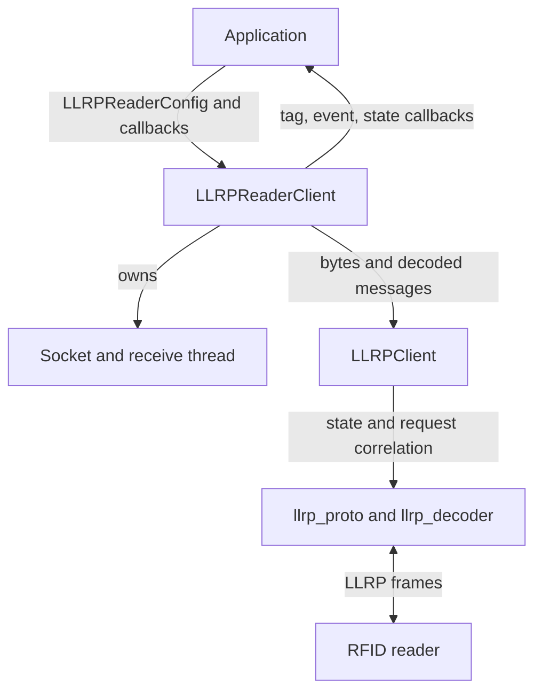
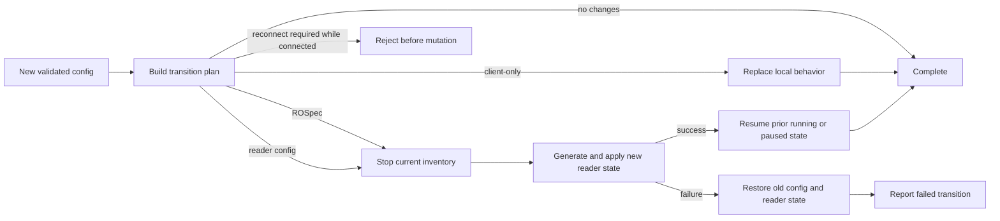

# Sllurp developer guide

This guide is for contributors and maintainers changing Sllurp itself. It
describes the repository architecture, concurrency and state model, supported
extension points, test strategy, documentation contract, and release process.
Read [CONTRIBUTING.md](CONTRIBUTING.md) for the short pull-request checklist.

## Development setup

```bash
git clone https://github.com/GuLuLuIt/sllurp.git
cd sllurp
python3 -m venv .venv
source .venv/bin/activate
python -m pip install --upgrade pip
python -m pip install -e ".[dev]"
pytest -W error
```

On Windows PowerShell, create the environment with `py -3.12 -m venv .venv`
and activate it with `.\.venv\Scripts\Activate.ps1`.

Python 3.10 through 3.14 are supported. Keep code compatible with the oldest
supported interpreter even if a newer interpreter is used locally.

## Repository map

| Path | Responsibility |
|---|---|
| `sllurp/llrp.py` | Application client, protocol session, state machine, ROSpec/AccessSpec construction |
| `sllurp/llrp_proto.py` | LLRP message and parameter registry plus binary encoders/decoders |
| `sllurp/llrp_decoder.py` | Frame and parameter-header decoding primitives |
| `sllurp/llrp_runtime.py` | Configuration transition planning and pending-request correlation |
| `sllurp/secure.py` | Explicit TLS client and SSL-context helper |
| `sllurp/dedup.py` | Bounded, thread-safe timed tag deduplication |
| `sllurp/readers.py` | Capability-oriented reader profile registry |
| `sllurp/reader_management.py` | Generic secure HTTP management transport and factory |
| `sllurp/*_management.py` | Vendor-specific documented management adapters |
| `sllurp/zebra_iot.py` | Zebra IoT Connector local REST transport |
| `sllurp/cli.py` | Click command definitions and option validation |
| `sllurp/entrypoint.py` | Installed `sllurp` command wrapper and version option |
| `sllurp/verb/` | CLI workflow implementations for inventory, access, log, and reset |
| `sllurp/_protocol_fixes.py` | Narrow compatibility patches applied at import time |
| `sllurp/_runtime_fixes.py` | Narrow runtime patches applied at import time |
| `examples/` | Small, runnable consumer examples |
| `docs/` | Focused feature and hardware guides |
| `tests/` | Unit, regression, packaging, documentation, and optional hardware tests |
| `.github/workflows/` | Cross-platform CI and tagged release automation |

The `_protocol_fixes.py` and `_runtime_fixes.py` modules isolate audited fixes
against inherited code. New work should normally modify the owning module.
Extend a fix module only when retaining the patch boundary is deliberate and
the behavior has a focused regression test.

## Runtime architecture

The application-facing `LLRPReaderClient` owns transport and callbacks. Its
`llrp` attribute is an `LLRPClient`, which owns the protocol state machine and
request/response logic.



An ordinary connection proceeds through these responsibilities:

1. `LLRPReaderClient.connect()` opens TCP or TLS and starts the receive thread.
2. The reader's initial event drives `LLRPClient` state transitions.
3. Capabilities and configuration are requested and validated.
4. Sllurp generates and installs an ROSpec and optional reader configuration.
5. Inventory starts and `RO_ACCESS_REPORT` messages reach registered callbacks.
6. `disconnect()` requests a polite stop, removes session state, and closes the
   transport.

Do not bypass state transitions by assigning `llrp.state` directly. Use the
existing state-machine methods so callbacks, timers, applied-state snapshots,
and pending operations remain consistent.

## Threading and callback rules

Each connected `LLRPReaderClient` normally has one receive thread. Message,
tag, event, state, and disconnect callbacks execute on that thread. The client
copies callback lists under a re-entrant lock before invocation, so callbacks
may be registered or removed safely, but application callbacks still need to
be short.

Contributor rules:

- never wait indefinitely inside a receive-thread callback;
- do not hold an internal lock while calling application code;
- use monotonic time for deadlines and cooldowns;
- cancel timers during disconnect and rollback paths;
- make disconnect and cleanup idempotent;
- keep callback exceptions isolated so one consumer cannot stop the reader
  loop;
- cover ordering-sensitive behavior with events or deterministic fakes, not
  fixed sleeps.

Tests should prove both the successful ordering and the late/duplicate/timeout
case for request correlation changes.

## Protocol state and requests

`LLRPReaderState` names the protocol states. `LLRPClient.setState()` is the
central state update point. State transitions can trigger application
callbacks and update the applied configuration snapshot.

Requests are correlated by expected response name and message ID through
`PendingRequestRegistry` in `llrp_runtime.py`. It prevents an unrelated or
stale response of the same type from completing the wrong operation. When
changing request logic:

1. allocate/serialize one message ID;
2. register the expected response before sending bytes;
3. arrange a finite timeout when the operation requires one;
4. remove or mark the request stale on timeout/cancel;
5. match both response type and message ID;
6. run user completion callbacks outside registry locks;
7. test late responses, duplicate responses, disconnect cleanup, and message-ID
   rollover where relevant.

Protocol status errors should become an `LLRPResponseError` or a more specific
Sllurp exception instead of being silently treated as success.

## Configuration model

`LLRPReaderConfig` validates user intent. The protocol retains four useful
views:

- **desired**: the configuration requested by the application;
- **generated ROSpec**: the reader program derived from the desired config;
- **applied**: the configuration known to have reached an active inventory;
- **reported reader**: normalized values returned by `GET_READER_CONFIG`.

`LLRPClient.get_config_state()` returns detached snapshots of those views.
Avoid returning mutable internal objects.



`build_config_transition_plan()` classifies live changes as:

- `client`: local callback/filter behavior;
- `rospec`: stop, regenerate, reinstall, and resume inventory;
- `reader-config`: write reader configuration as part of a transaction;
- `reconnect`: transport or session setup that cannot change in place.

When adding a config field, update all relevant layers:

1. define a safe default in `LLRPReaderConfig.__init__`;
2. validate type, range, and incompatible combinations;
3. add it to the transition policy in `llrp_runtime.py`;
4. consume it when generating transport, reader config, or ROSpec behavior;
5. expose a CLI option only if it makes sense for command-line users;
6. add unit and transition/rollback tests;
7. document the default, units, reader capability dependency, and live-change
   behavior;
8. add or update a runnable example when the feature is application-facing.

Reject invalid or reconnect-required changes before mutating live state.
Transaction failures must restore the prior local configuration and reader
behavior when possible, or enter a clearly disconnected state.

## Public API guide

Sllurp does not yet promise strict semantic-version stability for every symbol
inside every module. Treat these as the primary application entry points:

| Entry point | Purpose |
|---|---|
| `sllurp.__version__` | Installed package version |
| `LLRPReaderConfig` | Validated session and inventory configuration |
| `LLRPReaderClient` | Plain TCP client; can also select TLS through config |
| `LLRPTLSReaderClient` / `SecureLLRPReaderClient` | Explicit TLS client aliases in `sllurp.secure` |
| `LLRPReaderState` | State constants for callbacks |
| `C1G2TargetTag` and `C1G2*` OpSpecs | Tag selection and access operations |
| `TagReportDeduplicator` | Standalone timed report filter |
| `create_ssl_context` | Verified TLS context construction |
| `get_reader_profile` / `iter_reader_profiles` | Reader capability metadata |
| `HTTPReaderManager` / `create_reader_manager` | Generic and model-selected management clients |

The explicit TLS class is named `LLRPTLSReaderClient`; `SecureLLRPReaderClient`
is its descriptive alias. Low-level registry dictionaries, underscored
functions, import-time fix modules, and internal transition helpers are not
application stability boundaries.

When changing a public signature, preserve sensible keyword compatibility or
document the break in the changelog. Prefer adding an optional keyword-only
argument over changing positional meaning.

## Adding or correcting LLRP protocol support

The protocol registry in `llrp_proto.py` maps message and parameter names to
type metadata plus encoder/decoder functions. A protocol change needs more
than a successful round trip: an encoder and decoder can share the same bug.

Use this workflow:

1. cite the relevant GS1 LLRP version and section in the change or test;
2. verify type IDs, vendor IDs, subtype IDs, TV/TLV form, bit widths, signedness,
   byte order, reserved bits, and length accounting;
3. add a test vector with independently derived bytes;
4. test truncated and malformed input as well as the valid form;
5. test repeated parameters as zero, one, and many values where legal;
6. preserve unknown vendor data when safe instead of inventing a structure;
7. confirm an encoder does not mutate the caller's dictionary;
8. document reader/firmware evidence for vendor extensions.

Normative specifications are linked from [docs/index.rst](docs/index.rst).
Do not commit standards PDFs to the repository.

## Adding a reader profile

Reader profiles in `sllurp/readers.py` are capability hints, not claims that
every firmware behaves identically. To add one:

- use a stable, normalized key;
- list exact model names and conservative aliases;
- mark Secure LLRP `True` only with vendor documentation or reproducible
  evidence, `False` only when unsupported is known, and `None` when unknown;
- record an LLRP version only when established;
- keep notes factual and firmware-aware;
- add lookup, alias, and filter tests;
- update [docs/readers.rst](docs/readers.rst).

Avoid using a profile to silently enable vendor behavior merely because a
model name resembles another reader.

## Adding a management adapter

Vendor management is separate from the LLRP state machine. New adapters should
build on `HTTPReaderManager` where possible so TLS verification, authentication,
timeouts, response limits, and same-origin redirect protection stay uniform.

Requirements for an adapter:

- implement only documented endpoints or operations;
- verify TLS by default;
- never forward credentials across an origin-changing redirect;
- bound response sizes and timeouts;
- normalize HTTP, XML, JSON, and SOAP errors into useful exceptions;
- use `defusedxml` for untrusted XML;
- redact secrets from exceptions and logs;
- state model/firmware coverage conservatively;
- test with fake transports and recorded non-sensitive shapes;
- keep destructive operations explicit and clearly named.

Add the factory mapping in `create_reader_manager()` only when model selection
is unambiguous. Update the relevant feature guide and example.

## CLI design

Click command definitions live in `sllurp/cli.py`; workflow code lives in
`sllurp/verb/`. Keep parsing and behavior separable so workflow logic can be
tested without a shell.

CLI changes should include:

- `CliRunner` tests for valid and invalid forms;
- a help string that states units, default, range, and surprising semantics;
- consistent host/port and TLS behavior across commands;
- a nonzero exit status for user-visible failure;
- an update to CLI recipes or the user guide;
- no secret value in logs or error messages.

The installed entry point uses `sllurp.entrypoint:cli`. `python -m sllurp`
currently invokes the base command module and is not the packaging entry point
used to test `sllurp --version`.

## Test strategy

Run the smallest relevant tests while iterating, then the full gate before a
pull request.

Useful focused commands:

```bash
pytest tests/test_llrp_objects.py -q
pytest tests/test_state_machine.py -q
pytest tests/test_llrp_runtime.py -q
pytest tests/test_secure.py -q
pytest tests/test_reader_management.py -q
pytest tests/test_documentation_links.py -q
pytest tests/test_release_distribution.py -q
```

Test categories in this repository include:

- binary protocol and validation tests;
- state-machine, timeout, concurrency, and rollback regressions;
- TLS and management security tests;
- reader capability and vendor extension tests;
- CLI and example smoke tests;
- documentation link, package, release, and repository-hygiene contracts;
- hardware regression definitions that should skip safely when hardware is not
  explicitly configured.

Prefer fake sockets, deterministic clocks, events, and captured protocol bytes
over live network calls. Hardware tests must identify model, firmware, feature,
and opt-in environment variables. They must never run against an arbitrary
address by default.

The full local gate is:

```bash
pytest -W error
pytest --cov=sllurp --cov-branch --cov-fail-under=65
python -m compileall -q sllurp tests examples
ruff check sllurp tests examples --select E9,F63,F7,F82,F401,F841,E722,B006,ISC004,B017
bandit -r sllurp -q
codespell
python -m build
python -m twine check dist/*
```

If a platform-specific failure cannot be reproduced locally, preserve its
traceback and environment details. Do not weaken a test solely because a
fixed sleep is flaky; synchronize on the actual event.

## Documentation contract

Public behavior is incomplete until users can discover and operate it. For an
application-facing change, update the appropriate layers:

- `README.rst`: concise project entry point and feature discovery;
- `QUICKSTART.md`: first successful install and read;
- `USER_GUIDE.md`: operational decisions and production use;
- `docs/*.rst`: focused feature details and hardware boundaries;
- `examples/`: copyable, runnable code;
- `DEVELOPER_GUIDE.md`: architecture, extension, and maintenance behavior;
- `CHANGELOG.md`: release-visible change;
- `RELEASE_NOTES.md`: the current release's operator-facing summary.

Use relative links for repository files. `tests/test_documentation_links.py`
checks that internal Markdown and reStructuredText links resolve. Examples must
compile, avoid real credentials, and use documentation-only addresses such as
`192.0.2.0/24` or obvious placeholders when a live address is not required.

Do not claim universal reader support from one hardware test. State the model,
firmware, protocol surface, and whether behavior is vendor-documented or only
observed.

## Security expectations

Treat readers as network devices processing untrusted traffic. Protocol and
management code must bound message sizes, validate declared lengths, reject
impossible values, and clean up sockets after parse or TLS failures.

Never commit or print:

- reader passwords or bearer tokens;
- private keys or client-certificate secrets;
- customer EPCs, TIDs, or access passwords;
- production IP addresses or DNS names;
- proprietary captures without authorization.

Report vulnerabilities through [SECURITY.md](SECURITY.md), not a public issue.

## Change checklist

Before requesting review:

1. Reproduce the problem with the smallest test or capture.
2. Identify the owning layer instead of patching the first visible symptom.
3. Add a regression test that fails before the fix.
4. Implement the smallest coherent change.
5. Exercise failure, timeout, disconnect, and rollback paths.
6. Update user, developer, feature, example, and release documentation as
   appropriate.
7. Run focused tests, then the full local gate.
8. Inspect the built wheel and source distribution for required files.
9. Review the diff for secrets, generated artifacts, and unrelated formatting.
10. Describe hardware validation honestly in the pull request.

## Release process

Version identity must agree across `sllurp/version.py`, the changelog, release
notes, install documentation, built metadata, tag, and GitHub Release. The tag
is a publication action: `vX.Y.Z` triggers the release workflow.

The complete maintainer checklist is in [RELEASING.md](RELEASING.md). Do not
publish this fork under the upstream PyPI project without explicit package
ownership and an intentional distribution decision.

## Further references

- [User guide](USER_GUIDE.md)
- [Contributing](CONTRIBUTING.md)
- [Documentation index](docs/index.rst)
- [Runtime configuration](docs/runtime-state.rst)
- [Reader compatibility](docs/readers.rst)
- [Examples](examples/README.md)
- [Support](SUPPORT.md)
- [Release process](RELEASING.md)
