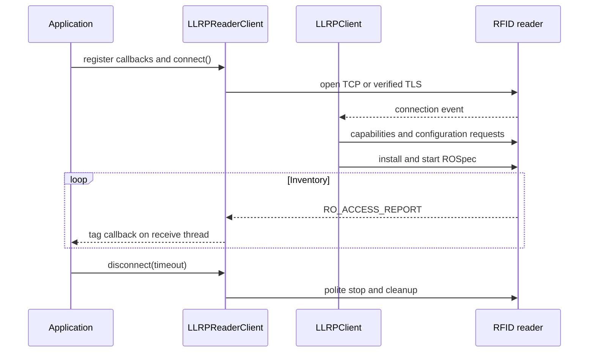
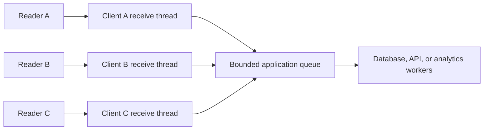

# Sllurp user guide

This guide explains how to use Sllurp reliably in an application or from the
command line. If you only need to prove that a reader is reachable, begin with
the [Quick Start](QUICKSTART.md). Return here when choosing report behavior,
building a long-running service, or diagnosing reader-specific behavior.

## What Sllurp controls

Sllurp speaks Low Level Reader Protocol (LLRP) to fixed UHF RFID readers.
LLRP controls inventory, tag access, reader capabilities, ROSpecs, AccessSpecs,
events, and reports.

Reader administration is a different control plane. Changing a reader's
network address, region, firmware, certificates, or services normally uses the
vendor's HTTPS or SOAP management interface. Sllurp includes selected,
documented management adapters, but those calls are not LLRP calls.

Keep these boundaries in mind:

| Task | Interface | Typical port |
|---|---|---:|
| Inventory and tag access | LLRP over TCP | 5084 |
| Encrypted inventory and tag access | Secure LLRP over TLS | 5085 |
| Reader administration | Vendor HTTP/HTTPS/SOAP API | Vendor-specific |

Ports are defaults, not discovery rules. A reader administrator can change
them, and not every model or firmware exposes every interface.

## Install an immutable release

This fork is released from `GuLuLuIt/sllurp` on GitHub. The `sllurp` project on
PyPI is a separately maintained upstream distribution and does not provide an
equivalent installation path for the features described here.

Create an isolated environment and install the 3.1.2 tag:

```bash
python3 -m venv .venv
source .venv/bin/activate
python -m pip install --upgrade pip
python -m pip install "git+https://github.com/GuLuLuIt/sllurp.git@v3.1.2"
sllurp --version
```

On Windows PowerShell:

```powershell
py -3.12 -m venv .venv
.\.venv\Scripts\Activate.ps1
python -m pip install --upgrade pip
python -m pip install "git+https://github.com/GuLuLuIt/sllurp.git@v3.1.2"
sllurp --version
```

For offline or controlled deployments, download the wheel and
`SHA256SUMS.txt` from the matching GitHub Release, verify the checksum, and
install the wheel file. See [RELEASE_NOTES.md](RELEASE_NOTES.md) for the exact
commands.

## Before connecting

Collect these values before troubleshooting code:

- reader model and firmware version;
- reader IP address or DNS name;
- whether LLRP is enabled;
- plain or TLS port;
- antenna IDs and physical antenna connections;
- regulatory region and legal channels;
- certificate authority and certificate hostname when TLS is enabled;
- any other process that may already own the reader's LLRP session.

Confirm basic reachability from the application host. A successful ping does
not prove that the LLRP port is open, and a blocked ping does not prove that
LLRP is unavailable.

## Command-line workflows

The installed command's help is authoritative for its version:

```bash
sllurp --version
sllurp --help
sllurp inventory --help
sllurp access --help
sllurp log --help
sllurp reset --help
```

### Inventory

Inventory one reader with antenna 1:

```bash
sllurp inventory 192.168.1.50
```

Use every antenna reported by the reader and stop after 30 seconds:

```bash
sllurp inventory -a 0 -t 30 192.168.1.50
```

Use selected antennas and maximum reported transmit power:

```bash
sllurp inventory -a 1,2 -X 0 192.168.1.50
```

Inventory multiple readers from the same process:

```bash
sllurp inventory -a 0 192.168.1.50 192.168.1.51
```

Use `--ro-report-every-n-tags N` to request a continuous RO_ACCESS_REPORT
after every N observations without ending the LLRP Antenna Inventory
Specification (AISpec). The legacy `--report-every-n-tags N` option ends that
inventory specification after N observations; it is not just a report flush
interval. This distinction matters for uninterrupted inventory.

### Logging observations

Write observations to CSV:

```bash
sllurp log -a 0 -o tags.csv 192.168.1.50
```

Use timestamps reported by the reader instead of host receipt time:

```bash
sllurp log -a 0 --reader-timestamp -o tags.csv 192.168.1.50
```

Reader clocks can drift. If observations from several readers must share a
timeline, synchronize reader clocks and record the host receipt time as well.

### Reading tag memory

Read two 16-bit words from the EPC bank:

```bash
sllurp access --read-words 2 --memory-bank 1 --word-ptr 0 --count 1 192.168.1.50
```

Memory-bank numbers are `0` Reserved, `1` EPC, `2` TID, and `3` User. Read
operations are safer than writes, but an AccessSpec still changes reader
state. Use `sllurp access --help`, select tags carefully, and test writes on
disposable tags before touching production inventory.

### Resetting LLRP state

If an interrupted client leaves ROSpecs or AccessSpecs behind:

```bash
sllurp reset 192.168.1.50
```

Reset here means cleaning LLRP state; it is not a factory reset or firmware
reboot.

## Secure LLRP

Certificate verification is enabled by default. Use a reader hostname that
matches the certificate:

```bash
sllurp inventory --tls reader.example.com
```

Trust a private certificate authority:

```bash
sllurp inventory --tls --tls-ca-file reader-ca.pem reader.example.com
```

Connect to an IP address while validating a DNS certificate name:

```bash
sllurp inventory \
  --tls \
  --tls-ca-file reader-ca.pem \
  --tls-server-hostname reader.example.com \
  192.168.1.50
```

For mutual TLS, add `--tls-client-cert` and `--tls-client-key`. Avoid
`--tls-no-verify` outside an isolated test environment: encryption without
peer verification does not protect against an impostor reader. The complete
TLS guide is [docs/secure_llrp.rst](docs/secure_llrp.rst).

## Python client lifecycle

The normal application-level API consists of `LLRPReaderConfig`,
`LLRPReaderClient`, callbacks, and the client's lifecycle methods.



```python
from sllurp.llrp import LLRPReaderClient, LLRPReaderConfig


def on_tags(reader, reports):
    host, port = reader.get_peername()
    for report in reports:
        print(host, port, report)


config = LLRPReaderConfig({
    "antennas": [0],
    "duration": 30,
    "disconnect_when_done": True,
    "ro_report_every_n_tags": 10,
})

reader = LLRPReaderClient("192.168.1.50", config=config)
reader.add_tag_report_callback(on_tags)
reader.connect()

try:
    reader.join(None)
finally:
    reader.disconnect(timeout=2)
```

`connect()` starts one receive thread for that reader unless
`start_main_loop=False` is passed. Callbacks run on the reader's receive
thread. Keep callbacks fast and non-blocking; move slow database, HTTP, or file
work onto an application-owned queue. Unhandled callback exceptions are
logged and the reader loop continues.

`disconnect()` requests a polite LLRP shutdown. A nonzero timeout waits for
the receive thread. `hard_disconnect()` is an emergency transport cleanup and
does not promise a polite reader-side stop.

### Tag report shape

The tag callback receives `(reader, reports)`, where `reports` is a list of
decoded `TagReportData` dictionaries. Fields are present only when the
configured content selector and reader provide them. Common keys include:

- `EPC-96`, `EPCData`, or `EPC` for identity;
- `AntennaID` for the reporting antenna;
- `ChannelIndex`;
- `PeakRSSI`;
- `FirstSeenTimestampUTC` and `LastSeenTimestampUTC`;
- `TagSeenCount`;
- vendor extension fields when explicitly enabled.

Treat missing optional fields as normal. Do not assume that all readers return
the same extension fields or scalar representation.

### Events and state changes

Register an LLRP reader-event callback with `add_event_callback(callback)`.
The callback receives `(reader, event_data)`. Register state-specific
callbacks with `add_state_callback(state, callback)`; those callbacks receive
`(reader, new_state)`.

Callbacks can be removed with the corresponding `remove_*` method. Register
callbacks before calling `connect()` so initial state transitions are not
missed.

## Choosing report and deduplication behavior

Reporting and deduplication solve different problems:

- report cadence controls when the reader sends observations;
- Antenna Inventory Specification (AISpec) termination controls when an
  inventory operation ends;
- deduplication suppresses repeated identities for a time window;
- RF telemetry preserves per-observation radio information.

Timed deduplication is opt-in:

```bash
sllurp inventory --dedup-seconds 2 --dedup-backend auto -a 0 192.168.1.50
```

`auto` uses supported reader behavior when it can and otherwise uses bounded
client memory. `hardware` fails if the reader/configuration cannot provide the
requested behavior. `memory` always filters in the client. With RF telemetry,
Sllurp selects memory deduplication because reader-side suppression can erase
antenna-specific observations.

For direction finding, phase analysis, or antenna comparisons, start with no
deduplication. If suppression is required, decide whether identity must include
the antenna. See [docs/rf-telemetry.rst](docs/rf-telemetry.rst) and
[docs/reader-management.rst](docs/reader-management.rst).

## Live configuration

Create a new `LLRPReaderConfig` instead of mutating the active instance in
place. Then call `apply_config()`:

```python
new_config = LLRPReaderConfig({
    "antennas": [1, 2],
    "tx_power": 0,
    "ro_report_every_n_tags": 25,
})

transition = reader.apply_config(new_config)
if not transition.wait(timeout=10):
    raise TimeoutError("configuration transition did not finish")
if not transition.succeeded:
    raise RuntimeError(transition.error)
```

Some changes are client-only, some require a ROSpec restart or reader config
write, and transport/session changes require a reconnect. A connected client
rejects reconnect-required changes rather than silently diverging from the
reader. Inspect the current views with:

```python
state = reader.llrp.get_config_state()
print(state["desired"])
print(state["generated_rospec"])
print(state["applied"])
print(state["reported_reader"])
```

See [docs/runtime-state.rst](docs/runtime-state.rst) for transition semantics
and rollback behavior.

## Multi-reader applications

Each `LLRPReaderClient` owns its socket and receive thread. A practical service
usually creates one client per reader and sends callback data into one
thread-safe application queue.



Do not use reader IP alone as a global identity if different ports or network
names can refer to distinct sessions. `reader.get_peername()` returns the host
and configured port. Make downstream writes idempotent because reconnects and
network retries can cause observations near a failure boundary to be seen
again.

On process shutdown, disconnect each reader and join it. As a final safety net,
`LLRPReaderClient.disconnect_all_readers()` can close live clients tracked by
the process.

## Reader management APIs

Use management APIs only for endpoints documented by the vendor. Do not guess
CGI paths or payloads from a different model family.

- Generic authenticated HTTP/HTTPS:
  [docs/reader-management.rst](docs/reader-management.rst)
- Zebra Reader Management and IoT Connector:
  [docs/zebra-iot-connector.rst](docs/zebra-iot-connector.rst)
- Impinj R700/R720 REST:
  [docs/impinj-management.rst](docs/impinj-management.rst)
- Honeywell/Intermec IF-series DCWS/SOAP:
  [docs/intermec-management.rst](docs/intermec-management.rst)

Management calls can reboot a reader, change its address, or disable the
service carrying the current session. Apply network and firmware changes from
a recovery-capable environment.

## Production checklist

Before leaving a client unattended:

- pin an immutable Sllurp release and record `sllurp --version`;
- verify the reader model, firmware, region, antennas, and ports;
- keep TLS verification enabled and rotate certificates deliberately;
- set a finite operation duration where a permanent session is not required;
- decide whether reconnect is appropriate and bound retries where necessary;
- keep callbacks fast and add backpressure to downstream work queues;
- monitor disconnections, reconnects, callback failures, and dedup evictions;
- avoid logging tag passwords, reader credentials, bearer tokens, private
  keys, customer EPCs, or production network details;
- test graceful shutdown and recovery from a killed process;
- retain a known-good reader configuration and firmware recovery procedure.

## Troubleshooting by symptom

### Connection refused

Confirm the address, LLRP enablement, port, VLAN/firewall policy, and that no
exclusive client session is already active. Plain and secure LLRP services may
be enabled independently.

### Connection times out

Check routing and firewall policy before changing Sllurp timeouts. A longer
socket timeout does not repair an unreachable network path.

### TLS verification fails

Inspect the certificate chain, expiry, hostname, and local clock. Supply the
correct CA with `--tls-ca-file`; use `--tls-server-hostname` when connecting by
IP to a certificate issued for DNS.

### Inventory connects but returns no tags

Confirm antenna connections and IDs, legal region/channel settings, transmit
power, tag frequency, tag orientation/range, reader RF mode, and whether a tag
filter is active. Try one known-good antenna and tag before increasing scope.

### Duplicate observations

Duplicates are normal RFID observations. Choose an explicit deduplication
window or make the consuming application idempotent. Do not enable hardware
deduplication if per-antenna telemetry must be preserved.

### Reader remains busy after a crash

Run `sllurp reset READER_HOST`, or use the vendor administration interface if
the LLRP service itself must be restarted. A factory reset should be a last
resort and is outside Sllurp's normal LLRP reset behavior.

### Need protocol diagnostics

```bash
sllurp --debug --logfile sllurp.log inventory 192.168.1.50
```

Review logs before sharing them and remove credentials, private addresses,
customer data, and tag identifiers as required by your environment.

## Where to go next

- [Quick Start](QUICKSTART.md) for platform-specific setup
- [API reference](API_REFERENCE.md) for Python interfaces, callbacks, fields,
  return values, exceptions, and copyable examples
- [Examples](examples/README.md) for runnable programs
- [Reader compatibility](docs/readers.rst) for model-family notes
- [Developer guide](DEVELOPER_GUIDE.md) for architecture and contributions
- [Support guide](SUPPORT.md) for a useful bug or hardware report
- [Security policy](SECURITY.md) for private vulnerability reporting
